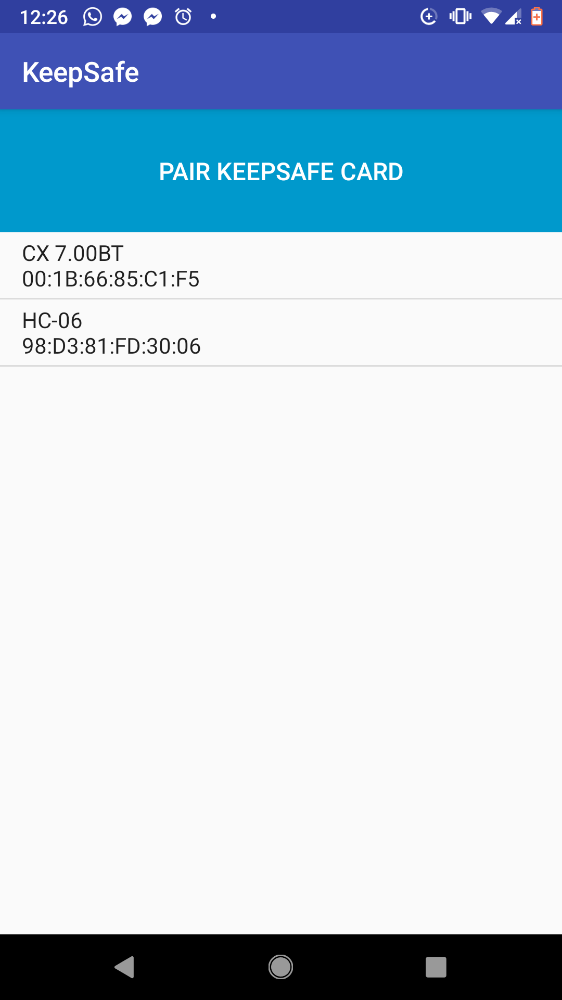
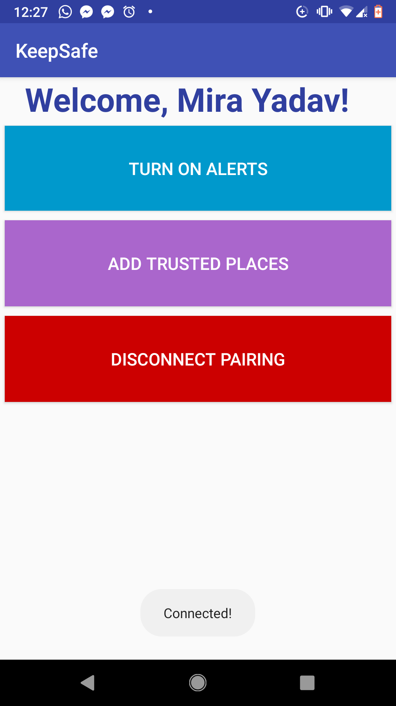
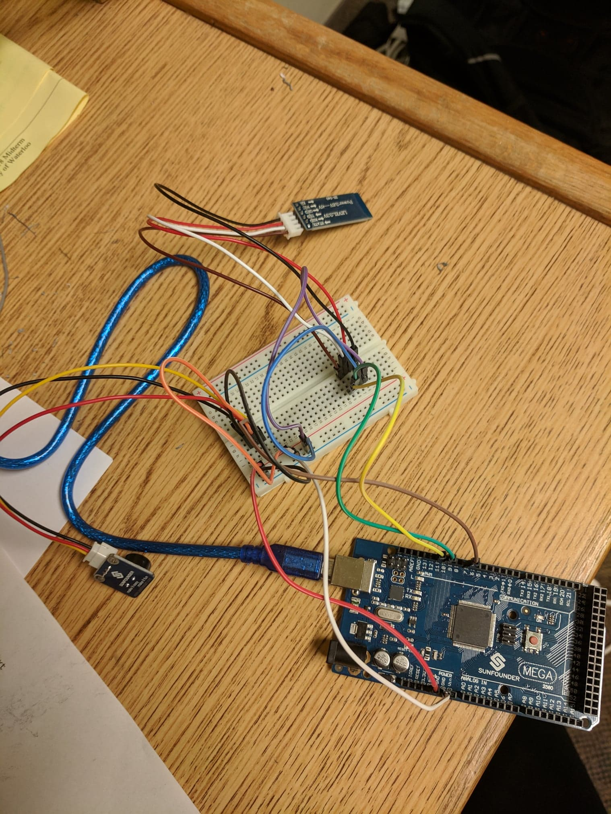

## KeepSafe

Portable arduino device connected to an Android Application that alerts you when you forget your phone!

## App Screen Shots

## Arduino Setup

## Reflection

KeepSafe was a month-long project created for my software engineering 101 class, where we were required to utilize Arduino to bring an idea to life. As someone who is pretty forgetful, I decided to create an Arduino device that would connect to my phone and alert me if I had left it behind by utilizing Bluetooth. 

The android application was programmed using AndroidStudio, specifically utilizing the Bluetooth Android API. Also, the Android Maps API was utilized to create certain safe spots where the device wouldn't turn on alerts. An Arduino Mega 2560 and HC-06 bluetooth module were used.
